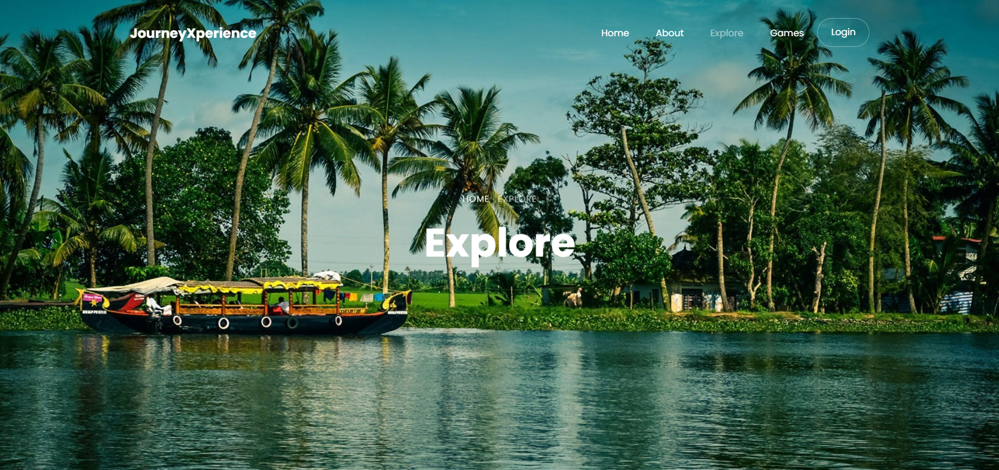
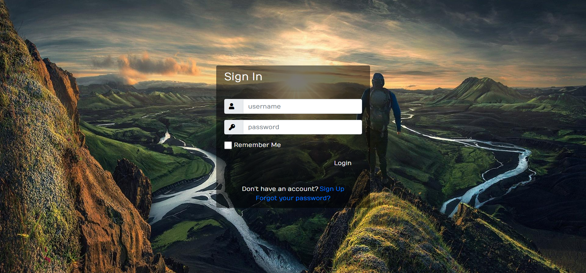
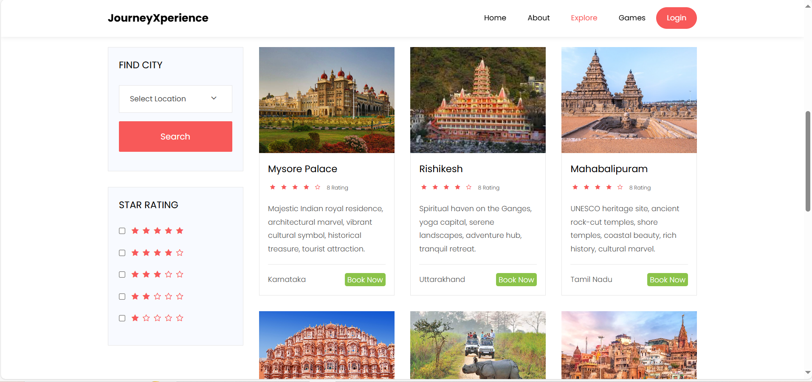

# 🏛️ JourneyXperience

**A cultural heritage platform that makes learning fun through games, quizzes, and interactive experiences.**

## 📱 Screenshots

  
  
  
  
  
  
  

## ✨ Features

- **🏛️ Cultural Quizzes** - Test knowledge about Indian heritage sites
- **🧩 Interactive Puzzles** - Solve heritage-themed puzzles
- **🎯 Scavenger Hunts** - Explore destinations through guided adventures
- **👤 User Accounts** - Login/signup to save progress
- **📱 Responsive Design** - Works on all devices
- **🎮 Gamified Learning** - Earn points and achievements

## 🚀 Quick Start

### Option 1: Basic Use (No Server)
1. Download the project
2. Open `index.html` in your browser
3. Start exploring!

### Option 2: Full Features (With PHP)
1. Install XAMPP or WAMP
2. Copy project to `htdocs` folder
3. Start Apache server
4. Visit `http://localhost/JourneyXperience`

## 🛠️ Technologies

- **Frontend**: HTML5, CSS3, JavaScript, Bootstrap
- **Backend**: PHP
- **Libraries**: jQuery

## 🎯 What You Can Do

1. **Explore Destinations** - Learn about heritage sites
2. **Take Quizzes** - Test your cultural knowledge
3. **Play Games** - Interactive puzzles and challenges
4. **Create Account** - Save your progress
5. **Discover Culture** - Immerse in Indian heritage

  <h3>🌟 Start Your Cultural Journey Today! 🌟</h3>
  
Explore, Learn, and Experience the Rich Heritage of India

**Made with ❤️ for Cultural Heritage Preservation** 